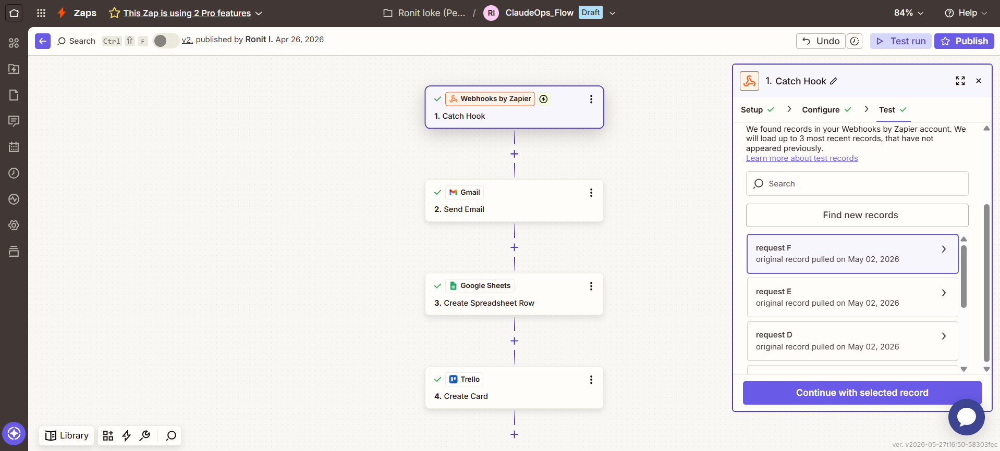
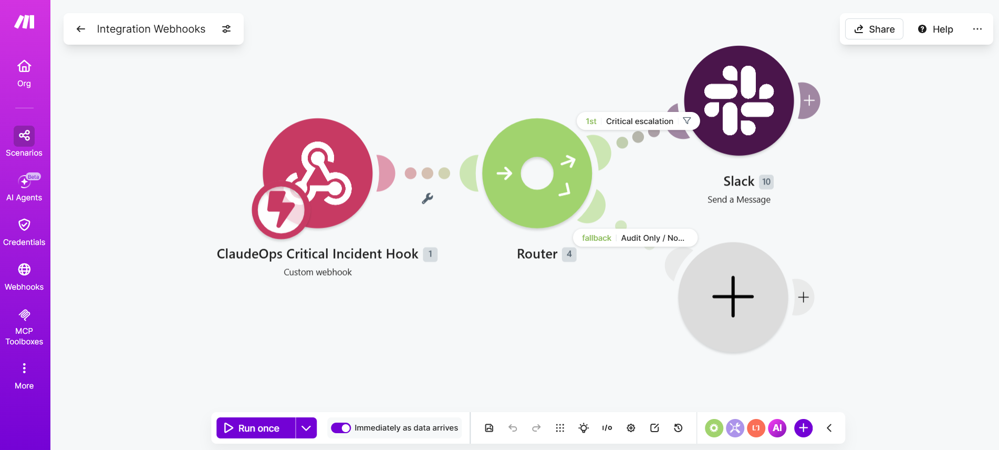
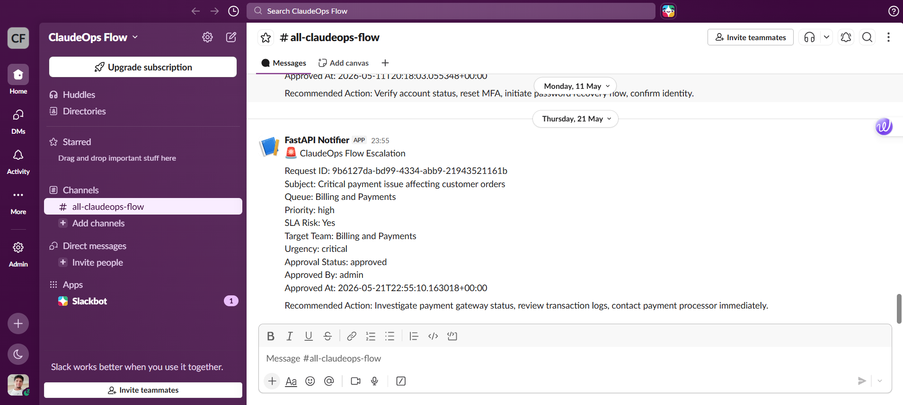
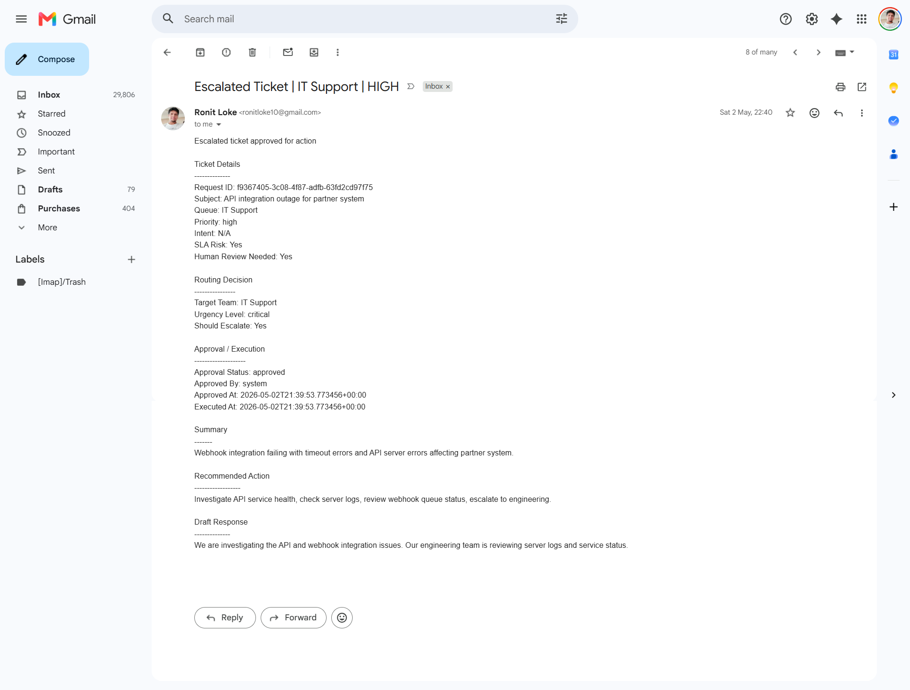
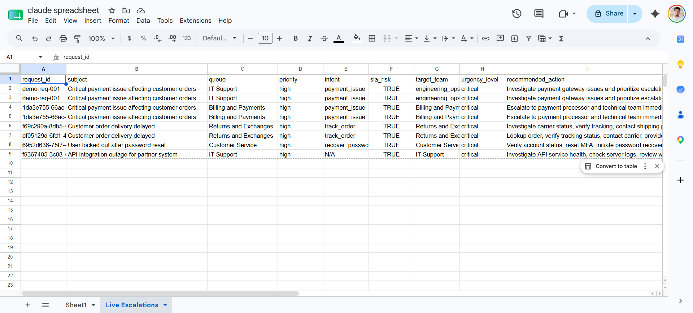
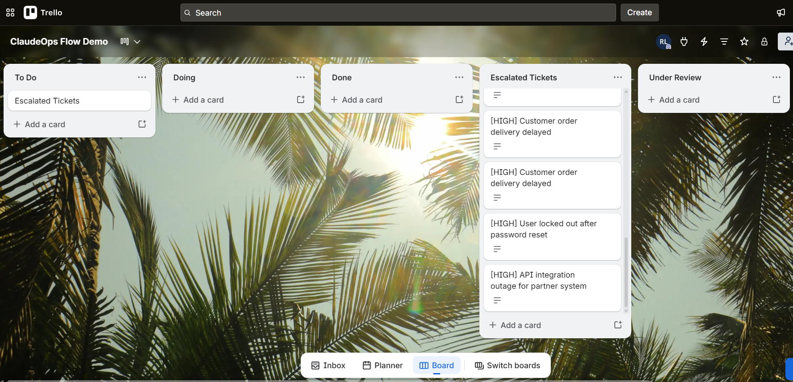

# ClaudeOps Flow

ClaudeOps Flow is a full-stack AI operations workflow platform that converts unstructured support tickets into structured triage decisions, escalation recommendations, human approval workflows, automation-ready payloads, benchmark analytics, and observability insights.

The project demonstrates how an AI-powered support operations system can be designed with production-style thinking: role-based access, deterministic routing, human approval gates, policy-based automation control, PostgreSQL logging, benchmark history, correction feedback, and monitoring dashboards.

---

## Preview

### Login & Workspace Selection & Live Ticket Submission
 

### Operations Dashboard & Human Approval Queue
 

### Integrations & Benchmark & Project Overview
 


---

## What This Project Does

ClaudeOps Flow takes a support ticket and performs an end-to-end AI operations workflow:

1. Accepts a support ticket from the Streamlit frontend.
2. Sends the request to a FastAPI backend.
3. Runs AI triage using an LLM provider.
4. Predicts queue, priority, intent, SLA risk, summary, and recommended action.
5. Stores request, response, latency, retry data, and metadata in PostgreSQL.
6. Applies automation decision logic.
7. Routes critical automation plans into a human approval queue.
8. Applies policy-based checks before external automation.
9. Prepares Zapier, Make, Slack, and generic webhook-ready payloads.
10. Tracks benchmark performance, observability, feedback corrections, and policy audit history.

---

## External Automation & Integration Proof

ClaudeOps Flow prepares approved escalation payloads for downstream automation tools.  
The screenshots below show the same escalation workflow being delivered into external tools such as Zapier, Make, Slack, Gmail, Google Sheets, and Trello.

| Integration | What it demonstrates | Screenshot |
|---|---|---|
| Zapier Workflow | Webhook-triggered automation flow connecting Gmail, Google Sheets, and Trello. |  |
| Make Scenario | Webhook-based routing scenario with conditional automation paths. |  |
| Slack Notification | Approved escalation payload delivered as an operational alert. |  |
| Gmail Escalation Email | Approved ticket converted into an escalation email with ticket context. |  |
| Google Sheets Logging | Escalated ticket data stored as structured rows for tracking and reporting. |  |
| Trello Escalation Board | Escalated tickets converted into actionable Trello cards. |  |

---
## Key Features

### AI Ticket Triage

- Predicts support queue
- Predicts ticket priority
- Detects likely user intent
- Detects SLA risk
- Generates ticket summary
- Generates recommended action
- Optionally generates a draft customer response

### Deterministic Routing

- Uses rule-based routing before LLM handling
- Supports specialist routing profiles
- Improves consistency and explainability
- Reduces dependency on one generic prompt

### Human Approval Queue

- Critical automation plans wait for approval
- Admin or Ops Analyst can approve/reject controlled actions
- Approval result is stored and visible in the dashboard
- Prevents automatic execution of sensitive workflows

### Policy-Based Automation Control

- Applies governance rules before outbound automation
- Tracks allowed and blocked external actions
- Supports least-privilege automation design
- Records policy audit history

### Integrations

- Zapier-ready webhook payloads
- Make-ready webhook payloads
- Slack/webhook-style contract design
- Stable outbound automation contract

### Benchmarking

- Runs benchmark samples
- Tracks queue consistency
- Tracks priority distribution
- Tracks escalation count
- Tracks latency distribution
- Stores benchmark history in PostgreSQL

### Observability

- Tracks latency
- Tracks errors
- Tracks retry counts
- Tracks token usage
- Tracks estimated cost
- Tracks low-confidence outputs
- Tracks correction feedback
- Tracks policy audit records
- Shows raw JSON traces for debugging

### Role-Based Frontend

Two demo workspaces are supported:

| Role | Access |
|---|---|
| Admin | Full access to submission, dashboard, approvals, integrations, benchmark, observability, and project overview |
| Ops Analyst | Access to ticket submission, operations dashboard, approval queue, and project overview |

---

## Tech Stack

### Backend

- Python
- FastAPI
- SQLAlchemy
- PostgreSQL
- Pydantic
- LLM API integration
- Policy engine
- REST APIs

### Frontend

- Streamlit
- Custom HTML/CSS
- Altair charts
- Pandas dataframes
- Role-based UI rendering

### Infrastructure

- Docker
- Docker Compose
- PostgreSQL container
- API container
- Streamlit container

---

## Architecture

```text
User
 │
 ▼
Streamlit Frontend
 │
 │  Submit ticket / view dashboards / approve automation
 ▼
FastAPI Backend
 │
 ├── AI triage service
 ├── Deterministic routing
 ├── Automation decision service
 ├── Approval service
 ├── Policy engine
 ├── Benchmark service
 └── Observability service
 │
 ▼
PostgreSQL
 │
 ├── triage logs
 ├── automation decisions
 ├── approvals
 ├── policy audit
 ├── benchmark runs
 ├── feedback corrections
 └── observability traces
 │
 ▼
Optional external automation
 │
 ├── Zapier
 ├── Make
 ├── Slack
 └── Generic webhooks

```

---

## Project Structure

```text
ClaudeOps-Flow/
│
├── app/
│   ├── core/
│   │   ├── __init__.py
│   │   └── settings.py
│   │
│   ├── data/
│   │   ├── __init__.py
│   │   ├── loaders.py
│   │   └── normalize.py
│   │
│   ├── db/
│   │   ├── __init__.py
│   │   ├── database.py
│   │   └── schema_guard.py
│   │
│   ├── models/
│   │   ├── __init__.py
│   │   ├── benchmark_run.py
│   │   ├── outbound_action_audit.py
│   │   └── triage_log.py
│   │
│   ├── repositories/
│   │   ├── __init__.py
│   │   ├── approval_repository.py
│   │   ├── benchmark_repository.py
│   │   ├── dashboard_repository.py
│   │   ├── policy_audit_repository.py
│   │   └── triage_log_repository.py
│   │
│   ├── schemas/
│   │   ├── __init__.py
│   │   ├── approval.py
│   │   ├── benchmark.py
│   │   └── triage.py
│   │
│   ├── services/
│   │   ├── __init__.py
│   │   ├── approval_service.py
│   │   ├── automation_contract.py
│   │   ├── automation_dispatcher.py
│   │   ├── automation_rules.py
│   │   ├── automation_service.py
│   │   ├── benchmark_accuracy_service.py
│   │   ├── benchmark_service.py
│   │   ├── claude_client.py
│   │   ├── deterministic_router.py
│   │   ├── gemini_client.py
│   │   ├── groq_client.py
│   │   ├── label_catalog.py
│   │   ├── llm_base.py
│   │   ├── llm_factory.py
│   │   ├── observability_service.py
│   │   ├── policy_engine.py
│   │   ├── prompt_builder.py
│   │   ├── queue_mapping.py
│   │   └── triage_service.py
│   │
│   ├── __init__.py
│   └── main.py
│
data/
├── processed/
│   ├── dataset_summary.json
│   ├── responses_unified.csv
│   └── tickets_unified.csv
├── raw/
│   ├── Bitext_Sample_Customer_Support_Training_Dataset_27K_responses-v11.csv
│   ├── dataset-tickets-multi-lang-4-20k.csv
│   └── dataset-tickets-multi-lang3-4k.csv
└── .gitkeep

│
├── docs/
│   ├── Screenshots/
│   │   ├── Backend/
│   │   │   ├── 01_backend_swagger_api_overview.png
│   │   │   ├── 02_backend_triage_ticket_success.png
│   │   │   ├── 03_backend_benchmark_run.png
│   │   │   ├── 04_backend_observability_summary.png
│   │   │   ├── 05_backend_correction_aware_summary.png
│   │   │   ├── 06_backend_outbound_automation_contract.png
│   │   │   ├── 07_backend_triage_log_detail.png
│   │   │   ├── 08_backend_pending_approvals.png
│   │   │   ├── 09_backend_approval_request.png
│   │   │   └── 10_backend_reject_approval.png
│   │   │
│   │   |── Frontend/
│   │   |    ├── 1. Login Page.png
│   │   |    ├── 2. Submit Ticket.png
│   │   |    ├── 3. Operations Dashboard.png
│   │   |    ├── 4. Approval Queue.png
│   │   |    ├── 5. Integrations & Benchmark.png
│   │   |    ├── 6. Observability.png
│   │   |    └── 7. Project Overview.png
│   │   └── Integrations/
|   |        ├── 01_zapier_workflow_overview.png
|   |        ├── 02_make_router_scenario.png
|   |        ├── 03_slack_escalation_notification.png
|   |        ├── 04_gmail_escalation_email.png
|   |        ├── 05_google_sheets_live_escalations.png
|   |        └── 06_trello_escalated_tickets_board.png
|   |
│   ├── architecture.md
│   └── demo_flow.md
│
├── scripts/
│   ├── apply_current_schema_fix.py
│   ├── __init__.py
│   ├── migrations_final_schema.sql
│   ├── module6_migration.sql
│   ├── module9_migration.sql
│   ├── module11_zapier_make_benchmark_migration.sql
│   ├── module12_feature_pack.sql
│   ├── module13_approval_queue_migration.sql
│   ├── module14_observability_migration.sql
│   ├── module16_policy_engine_migration.sql
│   ├── module17_feedback_correction_loop.sql
│   ├── module19b_indexes_pagination.sql
│   └── prepare_data.py
│
├── .env.example
├── .gitignore
├── Dockerfile.api
├── Dockerfile.streamlit
├── LICENSE
├── README.md
├── docker-compose.yml
├── requirements.txt
└── streamlit_app.py
```

---

## Setup Instructions

### 1. Clone the repository

```bash
git clone https://github.com/ronitloke/ClaudeOps-Flow.git
cd ClaudeOps-Flow
```

### 2. Create environment file

```bash
cp .env.example .env
```

On Windows PowerShell:

```bash
copy .env.example .env
```

Update .env with your local values.

### Run with Docker

This is the recommended way.

```bash
docker compose up --build
```

The services should run at:


| Service | URL |
|---|---|
| Streamlit Frontend | http://localhost:8501 |
| FastAPI Backend | http://localhost:8000 |
| FastAPI Swagger | http://localhost:8000/docs |
| PostgreSQL | localhost:5432 |

## Run Locally Without Docker

### 1. Create virtual environment

```bash
python -m venv .venv
```

Activate it:

Windows PowerShell:

```bash
.\.venv\Scripts\Activate.ps1
```

macOS/Linux:

```bash
source .venv/bin/activate
```

### 2. Install dependencies

```bash
pip install -r requirements.txt
```

### 3. Start FastAPI backend

```bash
uvicorn app.main:app --reload --port 8000
```

### 4. Start Streamlit frontend

Open another terminal:

```bash
streamlit run streamlit_app.py
```

Then open:

```bash
http://localhost:8501
```

### Demo Login

The demo login credentials are configured through .env.

Default example:


| Role | Username | Password |
|---|---|---|
| Admin | admin | admin123 |
| Ops Analyst | analyst | analyst123 |

## Main Application Pages

### Submit Ticket
Used to submit a support ticket and run the AI triage workflow.

**Shows:**
- Predicted queue
- Priority
- Intent
- Confidence
- SLA risk
- Latency
- Retry count
- Escalation decision
- Automation approval status
- Draft response
- Structured JSON output


### Operations Dashboard
Used to monitor stored triage logs.

**Shows:**
- Total tickets
- Success rate
- SLA-risk rate
- Escalation rate
- Average confidence
- Average latency
- Retry rate
- Top queue
- Distribution charts
- Latency trend
- Recent triage records
- Detailed request review


### Approval Queue
Used to review critical automation plans before external actions are executed.

**Shows:**
- Subject
- Summary
- Priority
- Queue
- Target team
- SLA risk
- Human review flag
- Approval reason
- Approve/reject buttons


### Integrations & Benchmark
Used to review automation readiness and benchmark the AI workflow.

**Shows:**
- Zapier hook status
- Make hook status
- Outbound workflow contract
- Benchmark runner
- Benchmark summary
- Benchmark charts
- Benchmark history


### Observability & Evaluation
Used to monitor production-style AI system behavior.

**Shows:**
- Runtime health
- Token and cost monitoring
- Latency/error/low-confidence alerts
- Correction-aware benchmark analytics
- Human feedback correction loop
- Correction analytics
- Policy-based tool access audit
- Raw observability JSON


### Project Overview
Used to explain the system clearly for GitHub, LinkedIn, and interviews.

**Shows:**
- System overview
- Processed tickets
- Success rate
- Escalation rate
- Average latency
- Product capabilities
- Core workflow
- Technical architecture
- Role-based experience

## API Overview

FastAPI exposes endpoints for:

```bash
POST /triage/ticket
GET  /config
GET  /contracts/outbound-automation/v1
GET  /approvals/pending
POST /approvals/{request_id}/approve
POST /approvals/{request_id}/reject
POST /benchmark/run
GET  /observability/summary
GET  /benchmark/correction-aware-summary
GET  /policy/audit/recent
POST /triage/logs/{request_id}/feedback
```

Swagger documentation is available at:

```bash
http://localhost:8000/docs
```

## Example Workflow

1. Login as Admin.
2. Submit a payment failure ticket.
3. Review the AI triage result.
4. Check the Operations Dashboard.
5. Open the Approval Queue.
6. Approve or reject the automation.
7. Review policy decisions.
8. Run a benchmark.
9. Check Observability metrics.
10. Review the Project Overview page.

## Screenshot Guide

Recommended screenshots for GitHub:


| File | Description |
|---|---|
| `1. Login Page.png` | Login page and workspace selector |
| `2. Submit Ticket.png` | Ticket submission and AI result |
| `3. Operations Dashboard.png` | Operations dashboard with charts and table |
| `4. Approval Queue.png` | Human approval queue |
| `5. Integrations & Benchmark.png` | Integration readiness and benchmark |
| `6. Observability.png` | Observability and evaluation page |
| `7. Project Overview.png` | Project overview and architecture |


## Future Improvements

- Add OAuth-based authentication
- Add role permissions from database
- Add Redis queue for async workflow execution
- Add Celery/RQ background workers
- Add email/Slack notification channels
- Add automated test suite
- Add production deployment guide
- Add model comparison dashboard
- Add prompt version management UI
- Add feedback-driven routing improvement

